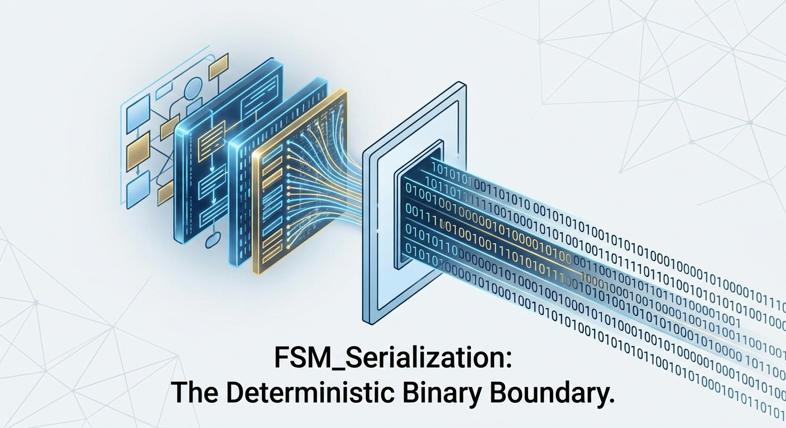
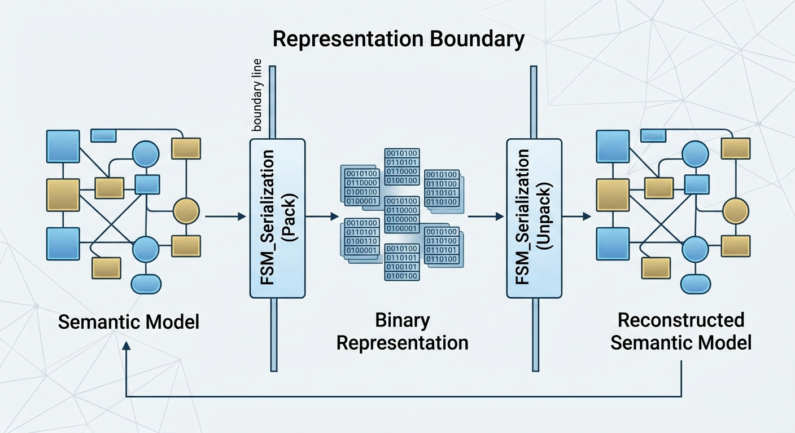
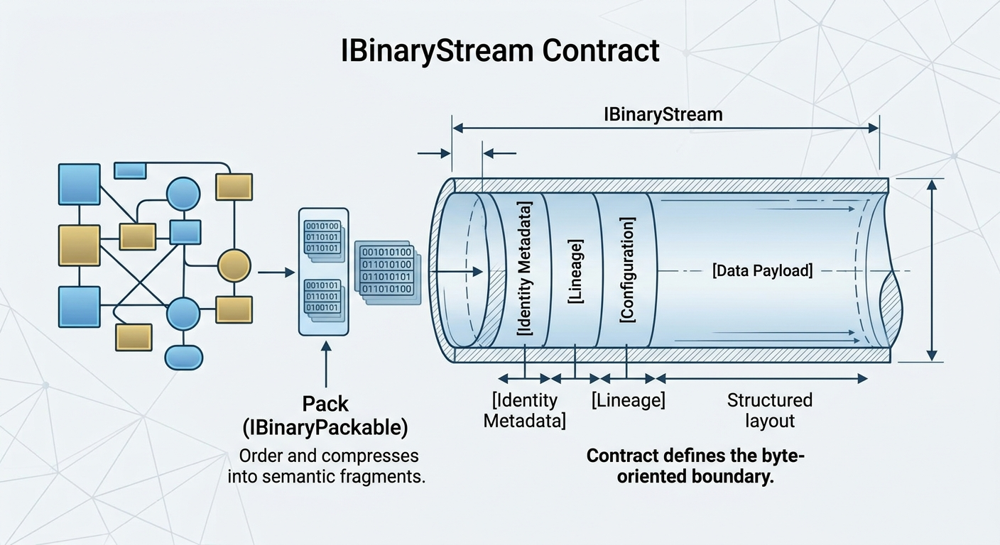
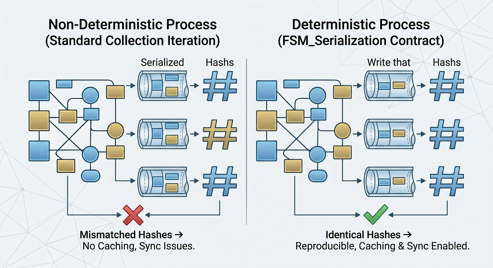
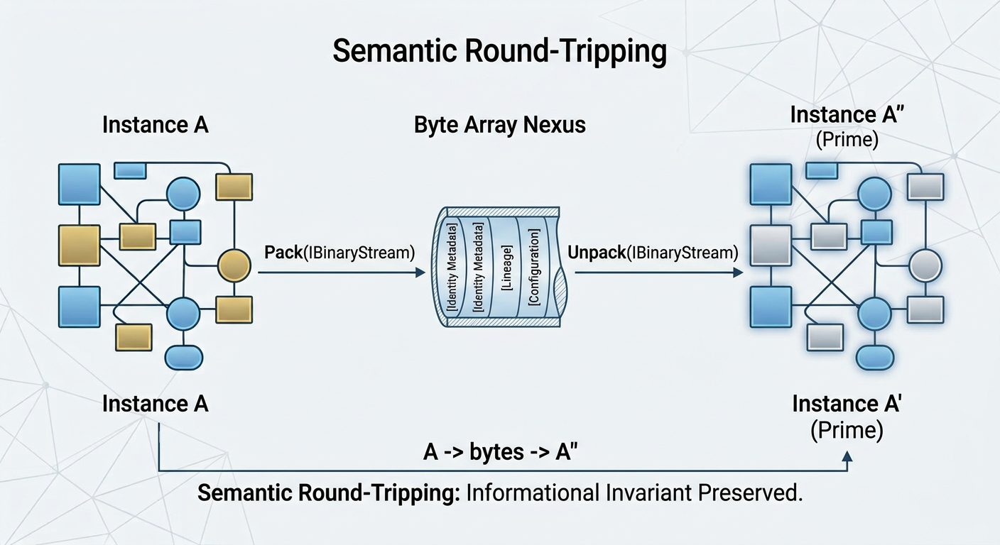
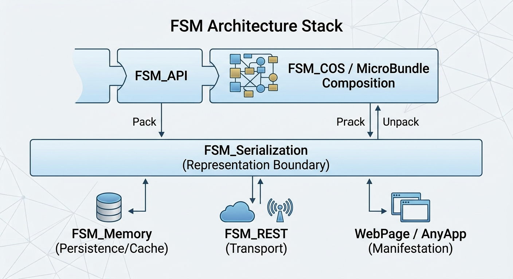

# TheSingularityWorkshop.FSM_Serialization

[](https://github.com/TrentBest/TheSingularityWorkshop.FSM_Serialization/actions/workflows/verify.yml)
[](https://codecov.io/gh/TrentBest/TheSingularityWorkshop.FSM_Serialization)
[](https://www.nuget.org/packages/TheSingularityWorkshop.FSM_Serialization/)



**A small, deterministic binary boundary for the FSM ecosystem.**

TheSingularityWorkshop.FSM_Serialization provides the low-level contracts and stream adapters needed to turn semantic state into bytes — and bytes back into semantic state.

It is intentionally simple.

Your domain objects own their meaning. This package gives them a clean, reusable place to cross the binary representation boundary.

## Why this package exists

As the FSM ecosystem grows, state needs to move between places:

- memory and persistence;
- applications and services;
- caches and transports;
- manifests and composition systems;
- WebPage, Forge, desktop, Unity, and other compatible hosts.

Those systems should not each invent their own binary stream abstraction.

FSM_Serialization provides the shared boundary.

The package originated in the WebPage/Workshop proving ground, where the binary IO model was exercised before being extracted into a reusable package.

## The basic idea

The relationship is deliberately straightforward:

```text
Your semantic type
      |
      | Pack
      v
  bytes / stream
      |
      | Unpack
      v
Reconstructed semantic type
```

The package supplies four core contracts:

- `IBinaryStream` — the byte-oriented stream boundary.
- `IBinaryPackable` — a type that knows how to write its representation.
- `IBinaryUnpackable` — a type that knows how to reconstruct its state.
- `IBinarySerializable` — the combined pack/unpack contract.

It also includes two useful stream implementations:

- `MemoryBinaryStream` — an in-memory implementation, useful for buffering and tests.
- `StreamBinaryStream` — an adapter over the standard .NET `Stream`.



## Install

From NuGet:

```bash
dotnet add package TheSingularityWorkshop.FSM_Serialization --version 0.1.0-alpha.2
```

Or add it to a project file:

```xml
<PackageReference Include="TheSingularityWorkshop.FSM_Serialization" Version="0.1.0-alpha.2" />
```

The package currently targets **.NET 8**.

## Quick start

A type decides what its own state means and implements the binary contracts:

```csharp
using TheSingularityWorkshop.FSM_Serialization;

public sealed class ExampleState : IBinarySerializable
{
    public int Value { get; private set; }

    public ExampleState()
    {
    }

    public ExampleState(int value)
    {
        Value = value;
    }

    public void Pack(IBinaryStream stream)
    {
        Span<byte> bytes = stackalloc byte[sizeof(int)];
        BitConverter.TryWriteBytes(bytes, Value);
        stream.Write(bytes);
    }

    public void Unpack(IBinaryStream stream)
    {
        Span<byte> bytes = stackalloc byte[sizeof(int)];

        if (stream.Read(bytes) != bytes.Length)
            throw new EndOfStreamException();

        Value = BitConverter.ToInt32(bytes);
    }
}
```

For an in-memory round trip:

```csharp
using var stream = new MemoryBinaryStream();

var original = new ExampleState(42);
original.Pack(stream);

stream.Position = 0;

var restored = new ExampleState();
restored.Unpack(stream);
```

The important design point is that **FSM_Serialization does not decide what `Value` means**. The owning type does.

## Pros and trade-offs

FSM_Serialization is deliberately small. That simplicity is useful, but it comes with explicit trade-offs.

### Pros

- **Small boundary:** a handful of contracts keep the serialization surface easy to understand and integrate.

- **Explicit ownership:** domain types decide what their state means and how it is represented.

- **Binary-first:** representations can be compact, deterministic, and suitable for persistence or transport.

- **No hidden serializer magic:** there is no reflection-driven object graph engine or global registry imposed by the package.

- **Storage-neutral:** `IBinaryStream` separates representation from memory, files, pipes, and other stream implementations.

- **Easy to test:** the core contracts can be exercised without a database, filesystem, network, or application host.

- **Composable:** higher-level FSM packages can build their own representations on top of the same boundary.

### Trade-offs

- **You own the format:** implementing types must define field order, widths, encoding, compatibility rules, and version behavior.

- **Less automatic than general-purpose serializers:** there is intentionally no automatic object-graph serialization here.

- **Binary is less human-readable:** inspecting a representation is harder than inspecting JSON or another text format.

- **Compatibility is a domain responsibility:** changing a binary representation requires an explicit migration or versioning strategy when old data must remain readable.

- **Not a storage layer:** the package gives you a representation boundary, not file management, databases, caching policy, or transport.

- **Not a schema framework:** if an application needs schemas, generated codecs, or rich reflection metadata, those concerns belong above this primitive layer.

The goal is not to eliminate those trade-offs. The goal is to make the boundary explicit so the system using it can make those choices deliberately.

## What you get

### Binary stream abstraction



`IBinaryStream` keeps consumers working against a small byte-oriented contract instead of tying domain code directly to a particular storage implementation.

It exposes the essentials:

- read/write capability;
- position and length;
- byte reads and writes;
- flushing;
- disposal.

### Memory and .NET stream adapters

Use `MemoryBinaryStream` when you need an in-memory representation.

Use `StreamBinaryStream` when you already have a standard .NET `Stream`.

This keeps the serialization contract separate from the storage mechanism.

### Explicit pack and unpack ownership

A serializable type is responsible for its representation.

That means the package does not require:

- reflection-driven object graphs;
- a global serializer registry;
- JSON;
- a database;
- a particular persistence system;
- domain-specific metadata hidden inside the serializer.

You define the representation that matters to your type.

## Deterministic representation



When a domain contract requires deterministic output, the implementation should make ordering and representation rules explicit.

That can support:

- reproducible persistence;
- content identity;
- caching;
- synchronization;
- version comparison;
- debugging;
- lineage records.

Determinism belongs to the representation contract and the type implementing it. It is not a promise that arbitrary object graphs will magically serialize identically.

## Round-tripping



The fundamental invariant is:

```text
A
 |
 | Pack
 v
bytes
 |
 | Unpack
 v
A'
```

`A'` does not need to be the same object instance.

It needs to preserve the information required by the owning semantic contract.

The test suite exercises this boundary directly before higher-level FSM objects are introduced.

## What belongs here

FSM_Serialization is intentionally a foundation package.

It is appropriate for binary representation of things such as:

- FSM state;
- MicroBundle descriptors;
- Experience manifests;
- dependency declarations;
- identity and version metadata;
- lineage metadata;
- runtime configuration;
- persistence and transport representations.

The domain package that owns a type remains responsible for deciding what its fields mean and how those fields are represented.

## What does not belong here

This package is **not**:

- an FSM domain rules engine;
- a game rules system;
- an AEC model;
- a GUI framework;
- a WebPage model library;
- a physics engine;
- a MicroBundle semantic layer;
- a database;
- a filesystem abstraction;
- an application framework.

Those concerns can use this package without becoming part of it.

For example, a filesystem can consume `IBinaryStream`, but filesystem policy belongs to the host/storage layer.

## Relationship to the FSM ecosystem



The broader architecture separates responsibilities:

```text
FSM_API
   |
FSM_COS / MicroBundle composition
   |
FSM_Serialization  <-- binary representation boundary
   |
FSM_Memory         <-- persistence / cache
   |
FSM_REST           <-- transport
   |
WebPage / AnyApp   <-- manifestation
```

FSM_Serialization crosses the representation boundary.

It does not decide what an Experience means.

## WebPage and the proving ground

WebPage was where this binary IO model was first exercised.

The extraction is intentional:

```text
WebPage / Workshop
        |
        | prove the model
        v
FSM_Serialization
        |
        | reusable package
        v
WebPage / Workshop
```

WebPage and other hosts should consume the package rather than maintain parallel binary contracts.

That gives the same small serialization boundary to every compatible host without making those hosts share domain-specific implementation.

## Testing and coverage

The repository contains an xUnit test project alongside the library.

The test suite is intended to protect the binary boundary itself, including:

- pack/unpack round trips;
- stream piping;
- memory stream behavior;
- standard .NET stream delegation;
- stream capability reporting;
- incomplete input handling;
- combined `IBinarySerializable` behavior.

GitHub Actions is configured as a **manual verification workflow** so validation can be run deliberately.

Verification performs:

1. restore;
2. Release build;
3. xUnit tests;
4. Cobertura coverage collection;
5. Codecov upload;
6. package creation;
7. test/coverage artifact upload.

The Codecov and workflow badges above reflect those configured verification services; they do not replace running the workflow.

## Documentation

The README is the starting point for using the package.

For the deeper architectural reasoning, see the theory documentation in the repository. It covers topics such as:

- representation versus reality;
- canonical representation;
- binary boundaries;
- storage versus representation;
- composition manifests;
- demand-driven reconstruction;
- versioning;
- lineage;
- format neutrality.

The README should answer **"What is this and how do I use it?"**

The theory should answer **"Why is it designed this way?"**

## Project status

This package is in **alpha**.

The current implementation is deliberately small and binary-first. Higher-level canonical manifest formats can be introduced later without replacing the primitive stream and pack/unpack contracts.

Current package version:

```text
0.1.0-alpha.2
```

## Contributing

The most useful contributions preserve the package boundary:

- keep the core contracts small;
- keep semantic ownership with the calling type;
- avoid pulling domain-specific rules into the serialization layer;
- add tests when changing binary behavior;
- keep storage and transport concerns in their respective layers.

For architectural questions, the theory documentation is the appropriate place to go deeper.

## License

MIT. See [LICENSE.txt](LICENSE.txt).

## Repository

[TheSingularityWorkshop.FSM_Serialization](https://github.com/TrentBest/TheSingularityWorkshop.FSM_Serialization)
